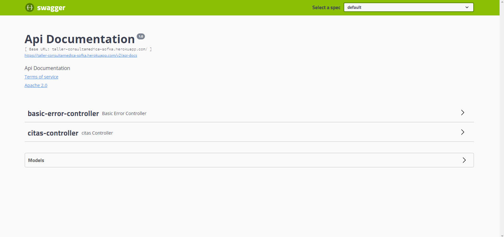

# Taller - SOFKA

## Reserva de citas médicas

Actividad la cual a través de Spring Boot la programación reactiva. 
Base de datos MongoDB alojado en Atlas

https://taller-consultamedica-sofka.herokuapp.com/swagger-ui.html

